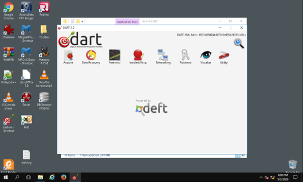
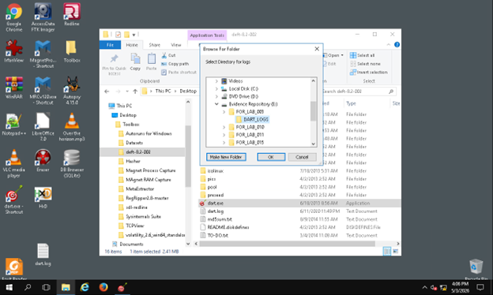
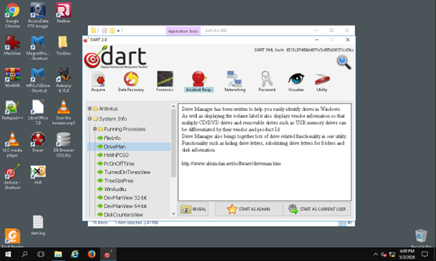
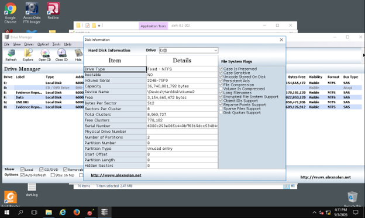
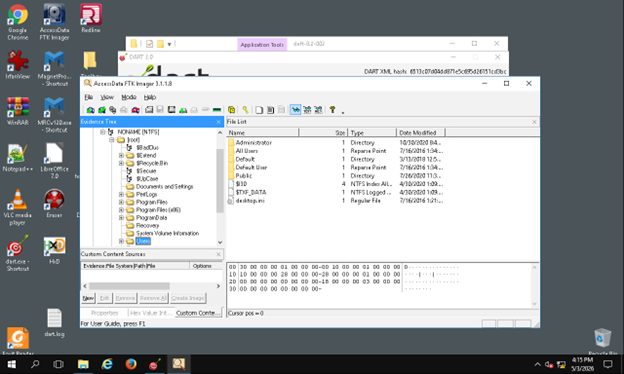
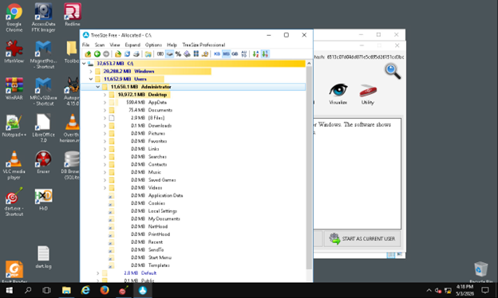
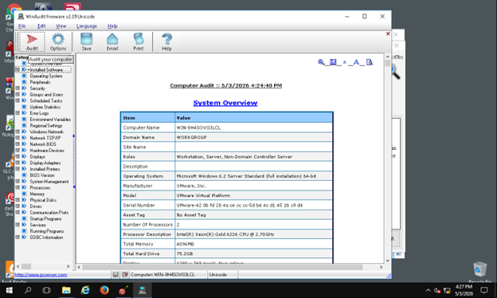
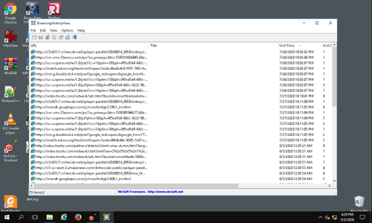
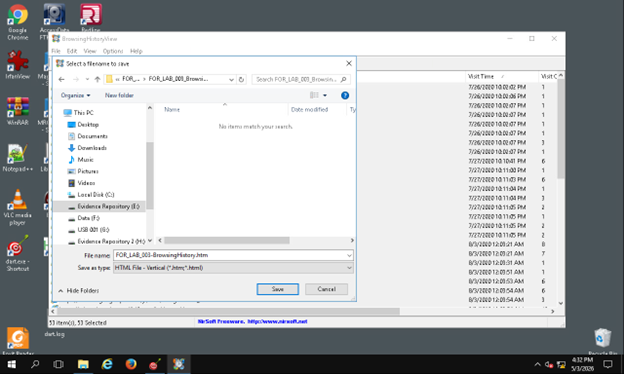

# Windows Live Forensics Triage Project

## Overview

This project demonstrates a live forensic triage workflow performed in a controlled Windows environment using the DEFT/DART forensic toolkit. The project focused on collecting system information, reviewing connected drives, examining the file system, identifying high-value user profile locations, and exporting browser history artifacts for later analysis.

The purpose of this project is to demonstrate foundational skills used in digital forensics, incident response, and cybersecurity investigations.

## Objective

The objective of this project was to simulate an initial live forensic investigation on a Windows system. The investigation focused on:

- Creating an organized evidence repository
- Identifying connected drives and disk details
- Reviewing physical drive and user profile structure
- Locating large data directories that may contain evidence
- Collecting system information
- Exporting browser history artifacts

## Tools Used

- DEFT/DART Forensic Toolkit
- Drive Manager
- TreeSize Free
- WinAudit
- BrowsingHistoryView
- Windows File Explorer
- Windows Virtual Machine

## Project Environment

The project was completed in a controlled Windows virtual machine. A dedicated evidence folder was created on the Evidence Repository drive to store forensic logs and exported artifacts.

Example evidence folder: `E:\FOR_LAB_003`

## Investigation Workflow

## 1. Launched the DEFT/DART Toolkit

I opened the extracted DEFT toolkit files and launched the DART application. After DART loaded, I confirmed that the forensic tool categories were available and ready for use.

**Skill demonstrated:** Forensic toolkit navigation and project setup.

---

## 2. Created an Evidence Repository

Before collecting artifacts, I created a dedicated evidence folder named `FOR_LAB_003` on the Evidence Repository drive. This folder was used to store logs, reports, and exported files from the investigation.

**Skill demonstrated:** Evidence organization and documentation discipline.

---

## 3. Reviewed Connected Drives

Using Drive Manager, I reviewed the drives connected to the Windows virtual machine. This included checking drive labels, sizes, and file system formats.

**Skill demonstrated:** Live system triage and disk identification.

---

## 4. Collected Disk Information

I selected the C: drive and reviewed disk information such as volume details, total capacity, bytes per sector, and file system flags.

**Skill demonstrated:** Disk inspection and forensic baseline collection.

---

## 5. Examined the Physical Drive Structure

I selected `PHYSICALDRIVE0` and expanded the file system tree to review partitions and user profile folders. The Users directory was reviewed to identify available user profiles.

**Skill demonstrated:** File system navigation and evidence location identification.

---

## 6. Analyzed Disk Usage with TreeSize Free

I scanned the local C: drive using TreeSize Free to identify large directories. The Windows and Users folders were among the largest data locations. I then reviewed the Administrator profile and identified Desktop and AppData as important areas for deeper analysis.

**Skill demonstrated:** Identifying high-value evidence locations based on disk usage.

---

## 7. Collected System Information with WinAudit

I used WinAudit to collect baseline system information, including system overview details such as the computer name, operating system version, installed memory, and current user account.

**Skill demonstrated:** Host profiling and system inventory collection.

---

## 8. Collected Browser History Artifacts

Using BrowsingHistoryView, I collected browser history artifacts from the system. The results included visited URLs, page titles, visit times, browser information, and associated user profile data.

The selected results were exported into an HTML report and saved in a dedicated browser history folder inside the evidence repository.

**Skill demonstrated:** Browser artifact collection and evidence export.

---

## Key Findings

- The system contained multiple drives visible through Drive Manager.
- The C: drive was identified as the primary Windows system drive.
- The Users directory contained multiple user profile folders.
- The Administrator profile contained high-value data locations, including Desktop and AppData.
- Browser history artifacts were successfully collected and exported for later review.

## Cybersecurity Relevance

This project demonstrates a practical live forensic triage process that could be used during an incident response investigation. These steps help an analyst quickly understand a system, identify user activity, locate important evidence sources, and preserve artifacts for further analysis.

The project also reinforces the importance of organized evidence handling, documentation, and repeatable investigative workflows.

## Skills Demonstrated

- Live forensic triage
- Digital evidence collection
- Disk and file system review
- User profile investigation
- Browser history analysis
- System auditing
- Incident response documentation
- Forensic reporting

## Lessons Learned

This project reinforced the importance of collecting system information in a structured and organized way. Creating an evidence repository before running tools helped keep exported artifacts separated from the live system. Reviewing disk usage also helped identify where an investigator should focus attention during a deeper forensic review.

Another key takeaway was the importance of documenting each action clearly. A forensic investigation should be understandable and repeatable so that another analyst can review the process, verify the work, and continue the investigation if needed.

This project also showed that user profile locations such as Desktop, AppData, and browser history can provide valuable insight during an investigation. These areas may help identify user activity, application usage, downloaded files, and other artifacts that support forensic analysis.

## Disclaimer

This project was completed in a controlled environment for educational and portfolio purposes. Any screenshots or exported artifacts included in this repository have been sanitized to remove sensitive information.
